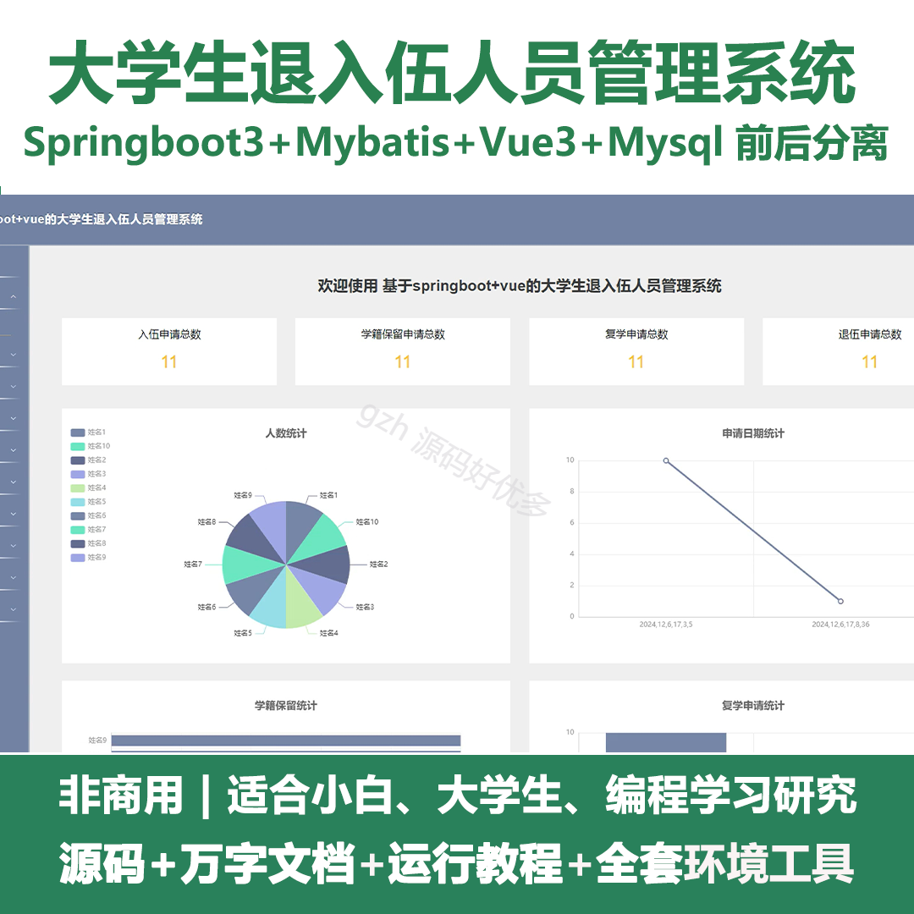
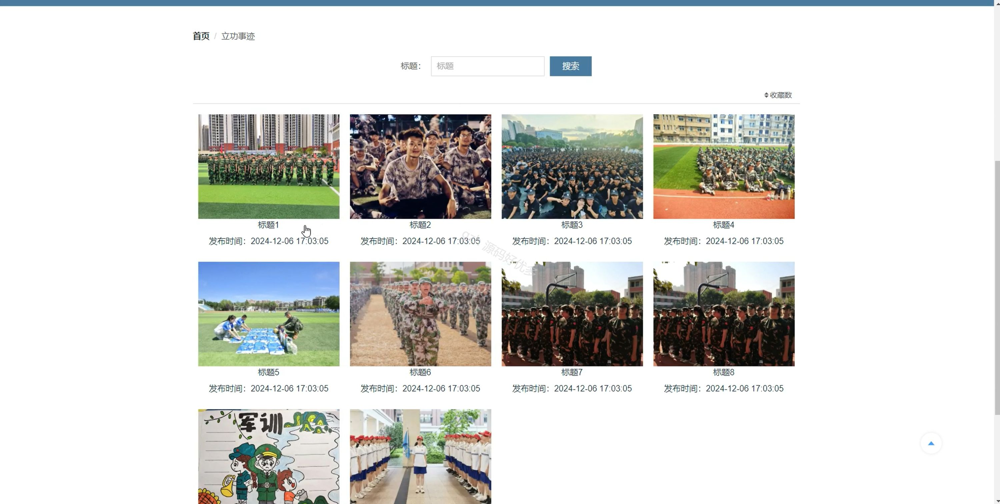
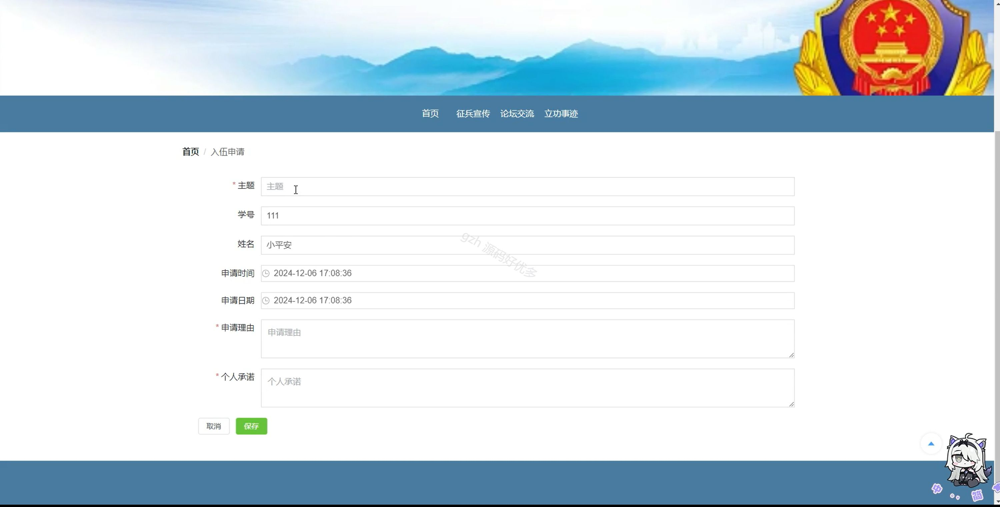
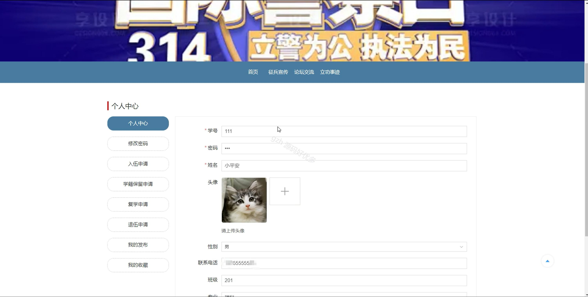
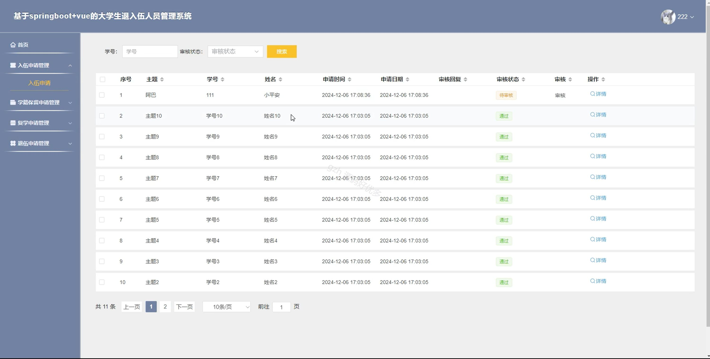
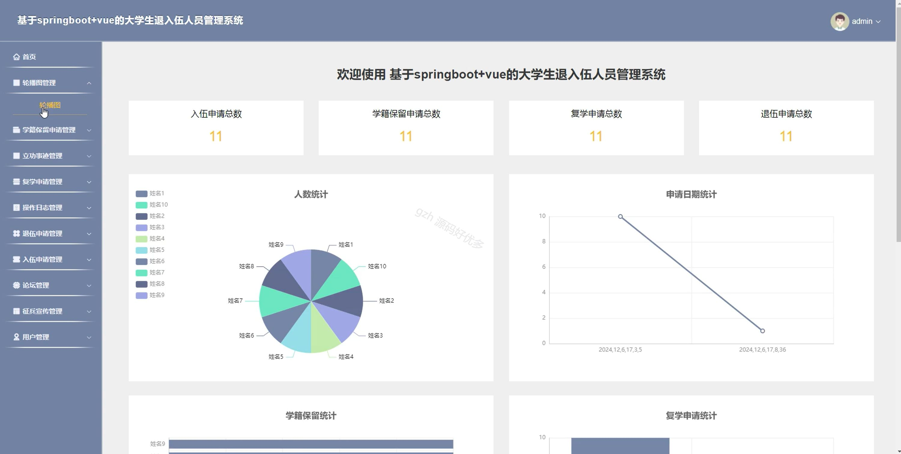
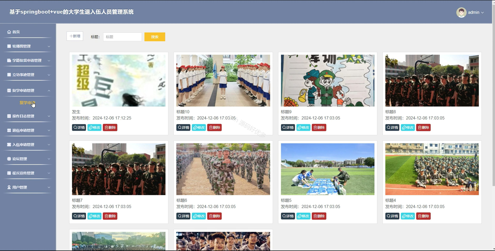
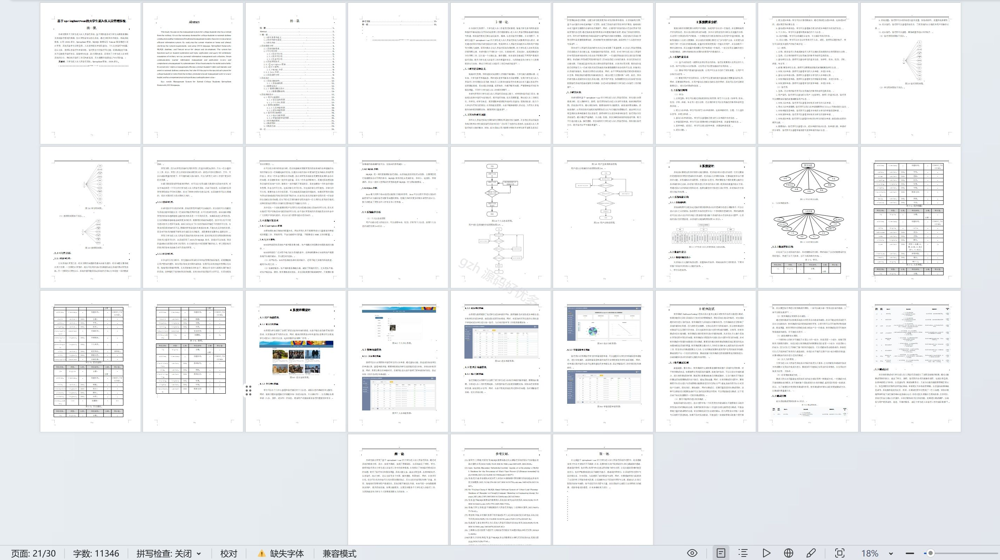

# springbootA224D
springbootA224D大学生退入伍人员管理系统+LW
 
## 查看主页获取源码

### 一、关键词
学籍保留申请管理、立功事迹管理、退伍申请管理

### 二、作品包含
源码+数据库+设计文档万字+全套环境和工具资源+本地部署教程

### 三、项目技术
前端技术：Html、Css、Js、Vue3.0、Element-ui 
后端技术：Java、SpringBoot3.0、MyBatis

### 四、运行环境（以下版本亲测，其他版本未知，请自测）
开发工具：IDEA/eclipse  + VSCODE

数据库：MySQL5.7（最低要5.7版本）

数据库管理工具：Navicat10以上版本

环境配置软件： JDK17 + Maven3.6.3

前端Nodejs：20

浏览器：谷歌浏览器

### 五、项目介绍
项目编号：springbootA224D

大学生退入伍人员管理系统可实现大学生入伍申请等流程及相关信息，全流程线上管理与高效服务。

角色：管理员、用户、教师

管理员：首页、轮播图管理、学籍保留申请管理、立功事迹管理、复学申请管理、操作日志管理、退伍申请管理、入伍申请管理、论坛管理、征兵宣传管理、用户管理。

用户：首页、征兵宣传、论坛交流、立功事迹、个人中心、修改密码、入伍申请、学籍保留申请、复学申请、退伍申请、我的发布、我的收藏。

教师：首页、入伍申请管理、学籍保留申请管理、复学申请管理、退伍申请管理。

### 六、运行截图

